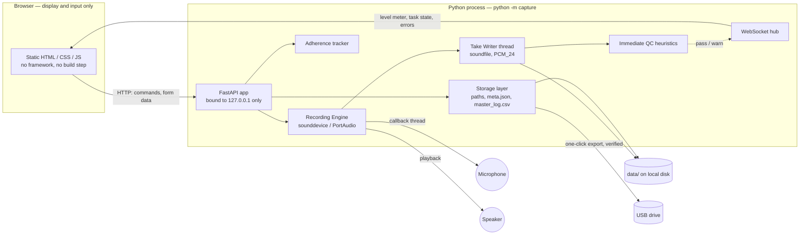
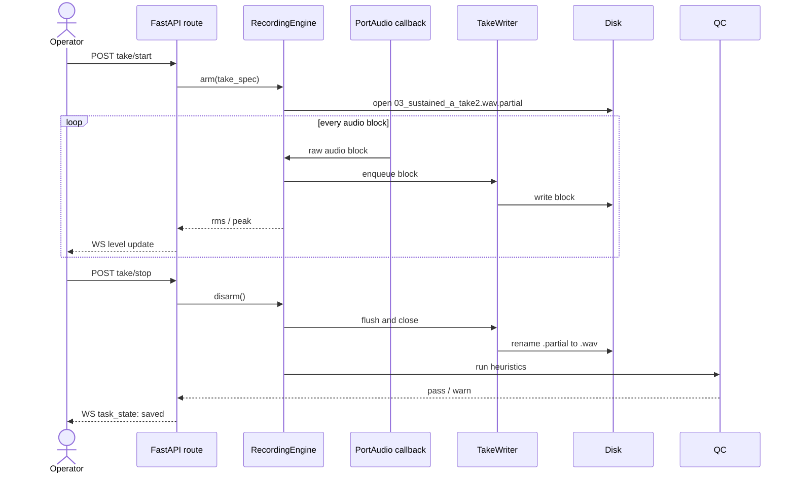
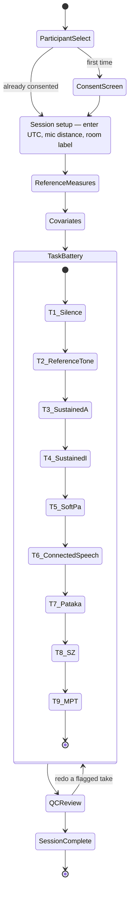

# Architecture — Voice Capture Tool

This is the system design for the tool specified in [claude.md](claude.md). That
file is the source of truth for *requirements*; this file is the source of
truth for *how the code is organized to meet them*. Where a decision below
isn't dictated by claude.md, it's marked as a judgment call so it's easy to
challenge.

**Timing note:** today is 2026-08-19; the mission runs 2026-08-22 to
2026-08-30. That's roughly three days of build/test time before this tool has
to work, unattended by anyone but Ravi, for a dataset that can't be recollected.
Section 15 turns this architecture into a build order with that constraint in
mind — read it early, not last.

---

## 1. System overview



The load-bearing boundary is the one between `Browser` and `PyProc`: the
browser never touches `navigator.mediaDevices`, never opens a WebSocket to a
microphone, and has no audio code at all. It renders instructions, renders a
meter driven by numbers the server sends it, and POSTs button presses. Every
requirement in claude.md's "Hard audio requirements" section falls out
naturally from keeping that boundary strict — there's no browser codepath
capable of adding AGC, echo cancellation, or lossy encoding because the
browser never has the audio.

---

## 2. Process & concurrency model

Three execution contexts share this one process, and keeping them distinct is
what makes "never lose a sample" tractable:

| Context | Runs | Must never |
|---|---|---|
| PortAudio callback thread | `sounddevice` native thread, fires per audio block | Block on disk I/O, allocate heavily, or raise past its own boundary silently |
| Take Writer thread | plain `threading.Thread`, blocking file I/O | Touch asyncio primitives directly |
| asyncio event loop (uvicorn) | FastAPI routes, WebSocket hub | Perform blocking disk/audio calls itself |

Flow: the callback thread hands each raw block to a bounded `queue.Queue`
(non-blocking `put`; if it's ever full, the take is aborted through the
session-fatal error path of §14 — a loud failure, never silent frame-dropping). The Writer thread drains that queue and is
the only thing that calls `soundfile` — this keeps the PortAudio callback tiny
and unlikely to under-run. The Writer also computes RMS/peak per block *from a
read-only view* of the same buffer it's about to write, and hands that number
to the event loop via `loop.call_soon_threadsafe`, which is what the
WebSocket hub broadcasts as the live meter. The buffer that reaches
`soundfile.write()` is never touched by the metering code — metering reads,
it does not transform.

### Take recording sequence



**The `.partial` → rename-on-clean-completion pattern is the single most
important line in this diagram.** A file only ever exists at its final name
(`03_sustained_a_take2.wav`) once it has been flushed, closed, and confirmed
complete. This is what directly satisfies two acceptance criteria at once:

- *Killing the process mid-session leaves completed takes intact* — true by
  construction, because "completed" and "has its final filename" are the same
  event.
- *Unplugging the mic produces a clear error, not a silent empty file* — a
  `PortAudioError` or callback status flag during recording aborts the write,
  the `.partial` file is left as-is (or deleted — see §6), and an `error`
  event goes out over the WebSocket instead of a rename ever happening.

### Input stream lifetime — decided, not left open

One real design choice: is the `InputStream` opened once per session and left
running (gated by whether the Writer is currently attached), or opened fresh
per take? **Recommendation: open once at session start, keep it running for
the session's duration.** Reasons:
- It gives you a live meter *before* the operator presses record, so they can
  see clipping and reposition the participant before wasting a take.
- Repeated open/close cycles are a repeated opportunity for a flaky driver to
  hand back a different device state; opening once and never touching device
  parameters again is the simplest way to honor "fixed input gain... the app
  must never change it."
- There is deliberately **no API route, no UI control, and no code path that
  sets input gain or volume** anywhere in this design. That guarantee is
  enforced by omission, not by validation — nothing exists to misuse.

---

## 3. Code layout

```
capture/                        # python -m capture
    __init__.py
    __main__.py                 # startup checks -> uvicorn.run -> open browser
    app.py                      # create_app(): routers + static mount + /ws (API docs disabled — Swagger pulls from a CDN)
    config.py                   # every constant: rates, durations, task order, thresholds, paths

    domain/
        models.py               # Participant, Session, Task, Take dataclasses
        tasks.py                # the fixed 9-task battery as data (see §7)
        state.py                # SessionStateMachine — the ONLY place transitions are legal
        time.py                 # dual-clock capture: utc_operator_entered, device_clock, monotonic

    audio/
        devices.py               # enumerate devices; read gain/enhancement flags where possible
        engine.py                 # RecordingEngine: owns the InputStream, arms/disarms takes
        playback.py                # reference tone + spoken demo playback (OutputStream)
        qc.py                       # clipping / RMS-range / voicing / duration heuristics

    storage/
        paths.py                 # filename + dir builders; collision-safe suffixing
        writer.py                 # .partial write, flush, rename-on-success
        metadata.py               # meta.json writer, master_log.csv appender (both append-only)
        consent_store.py          # consent JSON; pseudonym key lives OUTSIDE this package's data dir
        withdrawal.py             # delete participant data + write tombstone record

    adherence/
        tracker.py               # scans master_log.csv -> per-participant completion grid

    ws/
        hub.py                   # WebSocket connection registry + broadcast

    routes/
        session.py                # task/take flow endpoints
        consent.py
        dashboard.py
        export.py                 # USB copy + verify

    static/                      # served as-is, no build step, system fonts only
        index.html  dashboard.html  css/  js/  audio/  img/   # vendored tone, demo clips, instruction diagrams

data/                            # runtime output, per claude.md's exact layout — gitignored
tests/                           # stdlib unittest over the pure modules (tasks, paths, state)
```

Rationale for this split: `audio/` is the only place that imports
`sounddevice`/`soundfile`, so it's the only place that can violate the "no
processing" rule — keeping it small and flat means it stays "readable at 3am"
per claude.md's own convention. `domain/state.py` is the single place task
order is enforced, so "don't reorder without being asked" is one guard, not
scattered `if` statements across routes. `storage/` is where every
data-safety guarantee lives, isolated so it's testable without touching
hardware at all.

---

## 4. Domain model & session state machine



The session-setup step captures the operator-entered UTC together with
mouth-to-microphone distance and the room/location label — the physical-setup
fields claude.md's metadata section requires per session — before any audio
exists. Reference measures and covariates are captured as one block immediately
before the task battery starts, not interleaved between tasks. This satisfies
claude.md's "entered at the same moment as recording — simultaneity matters"
without breaking the fixed, must-not-reorder task sequence.

Each task in `TaskBattery` has its own take sub-state
(`armed → recording → saved`, with `redo` looping back to `armed` under a new
suffix — see §6). The state machine lives entirely server-side in
`domain/state.py`; the browser reflects state, it doesn't hold it. That
matters concretely: a tired operator's browser refresh, back-button press, or
double-click can't desynchronize the session, because the server rejects any
action that doesn't match the current legal state and there's no client-side
state to have drifted in the first place.

---

## 5. Time

Every session and every metadata record carries three independent clocks,
none of which is allowed to silently stand in for another:

| Field | Source | Purpose |
|---|---|---|
| `utc_operator_entered` | Operator types it in at session start, read from a trusted external source | The number analysis will actually trust |
| `device_clock` | Laptop's own clock at that instant | Recorded so drift is visible later, never used for ordering |
| `monotonic_session_start` + per-event offsets | `time.monotonic()` | Guarantees intra-session task ordering survives even if the entered UTC was mistyped |

claude.md requires that every filename and metadata record carry **both**
clocks. How that cashes out: the session directory name embeds the counter
plus entered UTC — claude.md's file-layout section prescribes exactly those
two for session IDs, and every take's path runs through that directory —
while `meta.json` and **every row** of `master_log.csv` carry
`utc_operator_entered` and `device_clock` side by side in full. Each take's
record additionally stores the device clock read at take completion and its
monotonic offset from session start. No code path ever derives, corrects, or
substitutes one clock from another.

`domain/time.py` is the only module that reads any clock. Nothing else in
the codebase calls `datetime.now()` — if a review ever finds a second call
site, that's a bug.

---

## 6. Storage & file safety

File layout matches claude.md exactly:

```
data/
  <participant_pseudonym>/
    <session_id>/
      meta.json
      01_silence.wav
      02_reference_tone.wav
      03_sustained_a_take1.wav
      03_sustained_a_take2.wav
      03_sustained_a_take3.wav
      04_sustained_i_take1.wav
      05_soft_pa_take1.wav
      06_connected_speech_take1.wav
      07_pataka_take1.wav
      08_sustained_s_take1.wav
      08_sustained_z_take1.wav
      09_mpt_take1.wav
      09_mpt_take2.wav
  master_log.csv
  consent/
    <participant_pseudonym>.json
```

Numeric prefix = task battery position (1–9); task 8 produces two files
(distinguished by name, not by a fractional prefix) since it captures both
/s/ and /z/.

`session_id` = `{session_number:03d}_{utc_operator_entered as YYYYMMDDTHHMMSSZ}`
— sortable, and doesn't depend on the untrusted device clock, per claude.md.

**Redo policy:** redo never deletes. A redo of `03_sustained_a_take2.wav`
writes `03_sustained_a_take2_redo1.wav`; `meta.json` records which file is
the kept one for that slot. This follows directly from "never overwrite" and
"redo without restarting" — and it's cheap: at 48 kHz/24-bit mono, a 30 s take
is ~4.1 MB, so a full mission (10 participants × 3 sessions/day × 7 days,
generously padded for redos) lands around 6–8 GB total. Keeping every attempt
costs nothing that matters and a bad take may still be diagnostically useful
later.

**Two append-only ledgers, written incrementally, never rewritten:**
- `meta.json` per session — the authoritative record for that session,
  written incrementally as each task completes (not held in memory and
  written once at the end).
- `master_log.csv` — one row appended **per completed task**, immediately,
  matching claude.md's "after every task, not at session end." This is what
  makes the adherence dashboard fast (scan one flat file) without needing a
  database.

**What `meta.json` holds** (written incrementally, per session):
- Session block — participant pseudonym, session number,
  `utc_operator_entered`, `device_clock`, input device name, sample rate,
  bit depth, OS gain reading, mouth-to-microphone distance in cm,
  room/location label.
- Reference measures block — urine specific gravity, urine colour chart
  value (1–8), body mass, fluid intake since last session.
- Covariates block — the full checklist from claude.md's metadata section.
- Per-take records — filename, task, take number, both clocks (§5),
  monotonic offset, duration, QC outcome, Borg rating where applicable, and
  which file is the kept one for any slot that was redone.

**"Not available" is a first-class value, not an error.** Every reference
measure and covariate can be recorded as explicitly-not-available, and no
form blocks progression on a missing value — claude.md: "a missing covariate
is a small loss; a refused session is a large one." The stored value
distinguishes "operator marked n/a" from "never asked", so an accidental
skip is still detectable afterwards.

**Why no database:** flat files plus the `.partial`-then-rename pattern give
crash-safety for free — a kill at any point leaves the last *fully written*
file as the newest valid state, with nothing to roll back or repair. SQLite
would add a dependency and a new failure mode (a corrupt DB file from a kill
mid-transaction) in exchange for query convenience this tool doesn't need at
this data volume.

---

## 7. Task battery configuration

Held entirely in `config.py` / `domain/tasks.py` as data, not scattered
across route handlers:

| # | Task | Takes | Stop mode | Target | Spoken demo | Borg CR-10 |
|---|---|---|---|---|---|---|
| 1 | Room silence | 1 | auto | 3 s | no | no |
| 2 | Reference tone | 1 | auto (= tone length) | fixed | n/a (plays tone, not speech) | no |
| 3 | Sustained /a/ | 3 | manual, guided | ~5 s | **no** (vowel) | yes |
| 4 | Sustained /i/ | 1 | manual, guided | ~5 s | **no** (vowel) | yes |
| 5 | Soft /pa/ repetitions | 1 | manual | guidance only | yes | yes |
| 6 | Connected speech (native language) | 1 | manual | ~30 s | no (participant reads fixed passage) | yes |
| 7 | /pa-ta-ka/ | 1 | manual | ~8 s | yes | yes |
| 8 | Sustained /s/, /z/ | 1 each | manual, max effort | no ceiling | yes | yes |
| 9 | Maximum phonation time | 2 | manual, max effort | no ceiling | **no** (vowel) | yes |

"No target duration" tasks (8, 9) still get a QC *floor* — a 1.5 s "maximum
phonation time" attempt is almost certainly an error, not a real result, even
though there's no ceiling.

Each task screen carries the per-task UI contract claude.md specifies: a
short written instruction in simple English with a vendored diagram where
useful (`static/img/`), the live meter with clipping indicator, and a redo
control for the current take. Spoken-demo clips are vendored audio files
played through the Python playback path — and they exist only for the
consonant tasks marked above. No demo asset is shipped for any vowel task at
all, making the pitch-anchoring mistake structurally impossible rather than
merely discouraged.

**Recommended addition, not in claude.md:** a hard 120 s safety-cap auto-stop
on every manual-stop task, purely as a backstop against a tired operator
forgetting to click stop and burning the next slot's time. It should never
bind in practice. Flagging it because it's my addition, not a requirement —
easy to remove if unwanted.

Connected-speech passages are fixed per participant and reused every session
— stored as `{participant_pseudonym: passage_text}` in a config-adjacent data
file the operator fills in during participant setup, not hardcoded.

---

## 8. Audio engine detail

Non-negotiable invariant, stated as code-shape rather than prose: the same
buffer object PortAudio hands to the callback is the one `soundfile.write()`
receives. Metering reads a numpy view of it to compute RMS/peak; nothing in
that path calls anything that mutates in place (no normalization, no
resampling, no filtering) — there is simply no function in `audio/engine.py`
capable of it.

**24-bit output is the one place to de-risk before building anything else on
top of it.** `soundfile` writes `PCM_24`, but there's no native numpy dtype
for 24-bit — the exact `sounddevice` stream dtype that produces a true,
lossless 24-bit file (rather than a 32-bit capture truncated in a way that
loses or misplaces bits) needs to be confirmed against the *actual* audio
interface that will be used in the habitat, not assumed from documentation.
This is a half-day spike, and it should happen first: record one take,
open it in Praat, confirm 48 kHz/24-bit with no surprises, before writing
anything else in `audio/`.

**Startup checks** (run from `__main__.py` before the browser opens):
1. Enumerate devices (`audio/devices.py`), log the selected input's name and
   OS-reported gain/volume — this is the drift-detection anchor claude.md
   asks for.
2. Attempt to read enhancement flags (Windows "Audio Enhancements", macOS
   ambient noise reduction). Recommendation: **don't build a bespoke
   platform-specific reader for this in v1.** claude.md already specifies the
   fallback (manual checklist), that fallback has zero dependencies and zero
   platform-specific risk, and there are three days of runway. Ship the
   checklist; treat automated detection as a stretch goal only if v1 is
   solid early.
3. One concrete Windows note: Windows 11 relocated per-device audio
   enhancements into Settings → Sound → device properties, in a different
   place than Windows 10's dialog. Whatever the manual checklist tells the
   operator to click through should be screenshotted from the **actual**
   habitat laptop, not written from memory of an older Windows version.
4. Scan `data/` and show a summary on the opening screen — how many sessions
   and takes exist so far — so a silent failure the previous day is visible
   immediately (claude.md, Data safety).

Task 2's reference tone plays through an `OutputStream`
(`audio/playback.py`) while the session's already-open `InputStream` records
— two independent streams, no loopback routing. The tone is a vendored WAV
asset, bit-identical every session, which is what makes week-scale drift
comparison meaningful.

---

## 9. Immediate QC

This is explicitly in scope despite the "no acoustic analysis" non-goal —
claude.md calls it out as a separate, required section, and the distinction
is real: these are integrity sanity checks (did we capture a plausible
signal at all), not the perturbation/cepstral feature extraction the
non-goals list excludes. `audio/qc.py` runs on a finished take, using numpy
only:

- **Clipping** — samples at/near full-scale for more than a few consecutive
  samples.
- **RMS out of range** — compared against that participant's own running
  mean from prior sessions (read from their prior `meta.json` files); no
  baseline yet on session 1, so this check reports "no baseline" rather than
  a false warning.
- **No voicing detected** — whole-take RMS below a noise-floor threshold.
- **Too short** — actual duration far below the task's target (tasks with no
  target use a floor, per §7).

Results render as a pass/warn list on the QC Review screen (see §4), letting
the operator redo a specific take without restarting the session.

---

## 10. Adherence dashboard

Reads `master_log.csv` (fast, one file, no per-session JSON opens needed) to
render a grid: participants × the 21 expected sessions (3/day × 7 days),
each cell complete / missing / flagged. Pure read-side reporting, no new
storage — this is the screen that makes a quietly-missed run of sessions
visible on day 4 instead of day 7, per claude.md's own framing. It's
genuinely useful starting the second day of the mission (day one has no
history to show gaps in yet), which matters for sequencing — see §15.

---

## 11. Consent, pseudonymity, withdrawal

- First-run **consent screen** per participant, timestamped, stored at
  `data/consent/<pseudonym>.json`, covering the five points claude.md lists:
  what is recorded, why, retention, who sees it, and the right to withdraw.
  Referenced only by pseudonym.
- The **name ↔ pseudonym mapping** is never written under `data/` at all —
  `storage/consent_store.py` takes an operator-configured path for it
  (defaulting outside the project tree; a separate USB stick that travels
  with Ravi and not with the laptop is a reasonable choice). This path is
  config, not a constant, precisely because it should not live in the
  codebase or the exported dataset.
- **Withdrawal** (`storage/withdrawal.py`) deletes
  `data/<pseudonym>/` and `data/consent/<pseudonym>.json` entirely, then
  writes a tombstone row (pseudonym, timestamp, "withdrawn") to a small
  separate ledger — so the *fact* of withdrawal survives even though the
  data doesn't, which is what claude.md asks for ("records that the
  withdrawal happened").
- **No network calls anywhere in the codebase.** Binding FastAPI to
  `127.0.0.1` enforces "no audio leaves the laptop" at the network layer, on
  top of there simply being no HTTP client code in the app.

---

## 12. USB export

One route, `storage/paths.py` + a verify step: walk `data/` recursively,
copy to the operator-selected destination, then walk the destination and
compare the file set and every file's byte size against the source — per
file, not aggregate totals, so two offsetting mismatches cannot cancel out
(claude.md asks for count and byte size, not a hash; hashing would be a
reasonable future addition but isn't required, so it's not in v1).
Mismatches are reported as
a blocking, loud failure, not a warning toast. The name↔pseudonym key file
deliberately is **not** part of this export — it's operator-managed outside
`data/` on purpose, and folding it into the one-click copy would defeat the
separation §11 relies on.

---

## 13. Interfaces

### WebSocket (`/ws`) — server → client push only

| Type | When | Payload |
|---|---|---|
| `level` | ~15–20 Hz while a stream is armed or recording | `rms_dbfs`, `peak_dbfs`, `clipping: bool` |
| `task_state` | on any legal state transition | current task/take id, status |
| `error` | device disconnect, write failure, disk full | `code`, `message` |

Commands flow the other way as plain HTTP POSTs, not over the socket — this
matches claude.md's own phrasing ("WebSocket for live level metering and
task state") and gives commands ordinary HTTP status codes and idempotency
instead of ad hoc WS message acking.

### HTTP routes

| Method | Path | Purpose |
|---|---|---|
| GET | `/` | Session flow shell |
| GET | `/dashboard` | Adherence grid |
| GET | `/api/participants` | Pseudonyms + consent status |
| POST | `/api/participants/{id}/consent` | Record consent |
| POST | `/api/participants/{id}/withdraw` | Withdraw + tombstone |
| POST | `/api/sessions` | Start session (time entry) |
| POST | `/api/sessions/{sid}/reference-measures` | USG, urine colour, mass, fluid intake |
| POST | `/api/sessions/{sid}/covariates` | Covariate checklist |
| POST | `/api/sessions/{sid}/tasks/{tid}/takes/{n}/start` | Arm + begin writing |
| POST | `/api/sessions/{sid}/tasks/{tid}/takes/{n}/stop` | Finalize, run QC |
| POST | `/api/sessions/{sid}/tasks/{tid}/takes/{n}/redo` | New suffix, rearm |
| POST | `/api/sessions/{sid}/tasks/{tid}/borg` | Borg CR-10 rating |
| GET | `/api/sessions/{sid}/qc-summary` | Pass/warn list |
| POST | `/api/sessions/{sid}/complete` | Close out session |
| GET | `/api/adherence` | Dashboard data |
| GET | `/api/summary` | Startup counts: sessions and takes on disk so far |
| GET | `/api/devices` | Input/output device, gain, enhancement status (read-only, no setter exists) |
| POST | `/api/export/usb` | Copy + verify |

Request/response bodies use `pydantic` models — already a transitive
dependency of FastAPI, not a new addition requiring justification under
claude.md's dependency rule.

---

## 14. Error handling

No bare `except` anywhere in `audio/` or `storage/`, per claude.md. Two
distinct severities, handled differently on purpose:

- **Take-level recoverable** (a QC warning, an out-of-range RMS) → shown on
  the QC review screen, operator redoes that take, session continues.
- **Session-fatal** (device disconnected, disk write failure, disk full) →
  the current take is aborted (its `.partial` file is left or removed, never
  renamed to a final name), an `error` WS event fires, and the UI shows a
  full-screen blocking error rather than letting the operator continue into
  a state where further takes would silently not be captured.

---

## 15. Offline packaging & de-risking, given ~3 days

Two facts compound here: no internet in the habitat, and no way to fix a
packaging problem once inside it. Both push toward doing all dependency
resolution now, on a machine with internet, and proving it works with
networking off before travel.

- Pin exact versions in `requirements.txt`; `sounddevice` ships PortAudio
  prebuilt in its Windows/macOS wheels, so a normal `pip install` ahead of
  time should need nothing extra system-side — but confirm this on the
  **actual habitat laptop**, not just a dev machine, since that's the
  hardware that has to work unattended.
- Test the full run with Wi-Fi/network adapters disabled before travel — not
  just "no browser tabs open," actually off.
- The UI ships system fonts and vendored assets only. A pre-travel grep for
  `https?://` across `static/` is a one-minute check that catches the
  classic offline killers (CDN scripts, remote fonts) before they matter.
- A PyInstaller single-file build is worth considering as a stretch goal to
  remove any dependence on a working venv in the field, but isn't necessary
  if the pinned-venv approach is tested end-to-end ahead of time.

### Suggested build order

1. **De-risk spike first:** the 24-bit capture path (§8), on real hardware.
   Nothing else matters if this doesn't produce a clean file.
2. `domain/` + `config.py` — pure Python, hardware-free, fast to get right
   and unit-test (state machine legality, filename generation, task order).
3. `audio/engine.py` + `storage/writer.py` + a bare CLI smoke test (record
   one take, no UI). This proves the hard requirements end-to-end before any
   web layer exists.
4. FastAPI + WS scaffolding + minimal static UI wired to the state machine →
   gets you to acceptance criterion 1 (a full session, on-screen only).
5. Metadata/CSV writers, consent screen, reference-measures/covariates forms.
6. QC heuristics + redo flow.
7. Startup device/gain logging + manual enhancement checklist, adherence
   dashboard, USB export. These can trail slightly — the dashboard's first
   real use is day 2 of the mission, not day 1, and export is only needed
   once there's data worth copying off.
8. Before travel: run acceptance criteria 2 and 4 for real — unplug the mic
   mid-take, `kill -9` the process mid-session — with networking off, on the
   actual laptop.

---

## 16. Assumptions to confirm

Everything above follows from claude.md except these, which fill gaps it
leaves open:

- Borg CR-10: claude.md's "a Borg CR-10 perceived-effort rating after the
  phonation tasks" reads either as one rating per phonation task or one
  rating after the whole phonation block. The design collects one per task
  3–9 — the superset, since an unwanted rating is easy to ignore later but
  an uncollected one is impossible to backfill. Confirm which was intended.
- Soft /pa/ repetitions (task 5) has no stated take count or duration —
  assumed 1 take, manual stop, on-screen guidance only, no hard target.
  Confirm.
- The 120 s safety-cap auto-stop (§7) is my addition, not a requirement.
- The name↔pseudonym key file's actual storage location is left as
  operator-set config rather than a fixed path — confirm where Ravi wants it
  to live (separate USB stick vs. elsewhere).
- Local server port is an arbitrary unused choice — no significance, easy to
  change.
- Session setup currently requires a UTC entry — the one field that cannot
  be "n/a", since the session ID embeds it. If the trusted source is ever
  unavailable at session time, the proposed handling is an explicit,
  loudly-flagged device-clock substitution recorded as such (never silent);
  confirm with Ravi whether that fallback should exist at all.
